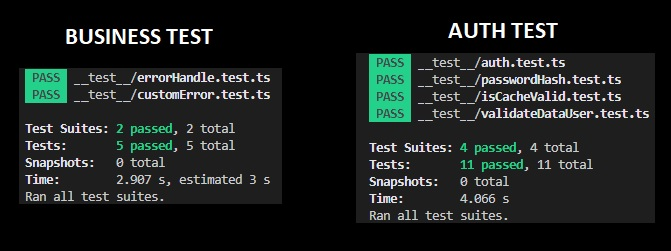

# Backend Node.Js (Microservicios)

## Tecnologías usadas

* AUTH - Backend-end: Node.js + Express + TypeScript
* BUSINESS - Backend-end: Node.js + Express + TypeScript
* Base de datos: MongoDB
* Cache: Redis


## Instrucciones de instalación y ejecución

* Instalar Docker -> https://www.docker.com/
* Clonar el Respositorio.
* Usar el comando `docker-compose up`, esperar que termine de levantar los servicios correspondientes.

## Respuesta de las API AUTH

```

http://localhost:3001/user (GET)
* Params : page: Number , per_page: Number, search: String, email: String,
* Headers: Authorization: Bearer {token}
* Description: Devuelve una lista de usuarios de forma paginada, permite usar search como buscador.
                Si se envía un email devuelve exactamente ese User
* Response:
  {
    "code": Number,
    "message": String,
    "success": Boolean,
    "data": {
      "total": Number,
      "per_page": Number,
      "current_page": Number,
      "last_page": Number,
      "from": Number,
      "to": Number,
      "data": [
        {
          "_id": String,
          "email": String,
          "description": String,
          "createdAt": String - ISO 8601,
          "updatedAt": String - ISO 8601
        }
      ]
    }
  }

http://localhost:3001/auth/login (POST)
* Description: Devuelve un token y datos del User
* Response:
  {
    "code": Number,
    "message": String,
    "success": Boolean,
    "data": {
      "token": String,
      "user": {
        "_id": String,
        "email": String,
        "description": String,
        "createdAt": String - ISO 8601,
        "updatedAt": String - ISO 8601
      }
    }
  }

http://localhost:3001/auth/register (POST)
* Description: Registra un nuevo User y devuelve sus datos
* Response:
  {
    "code": Number,
    "message": String,
    "success": Boolean,
    "data": {
      "user": {
        "_id": String,
        "email": String,
        "description": String,
        "createdAt": String - ISO 8601,
        "updatedAt": String - ISO 8601
      }
    }
  }

```

## Respuesta de las API BUSINESS
```

http://localhost:3002/user (GET)
* Params : page: Number , per_page: Number, email: String, search: String,
* Description: No se puede acceder,
* Response:
  {
    "code": Number,
    "message": String,
    "success": Boolean,
    "data": []
  }
* Example:
  {
    "code": 403,
    "message": "Forbidden",
    "success": false,
    "data": []
  }

```

## TEST
* Se hicieron varios test unitarios a varios utils de los 2 módulos: AUTH - BUSINESS
* Ejecutar npm run pre-test-auth y npm run pre-test-business para instalar dependencias
* npm run test-auth para ejecutar tests sobre el módulo  AUTH
* npm run test-business para ejecutar tests sobre el módulo  BUSINESS

